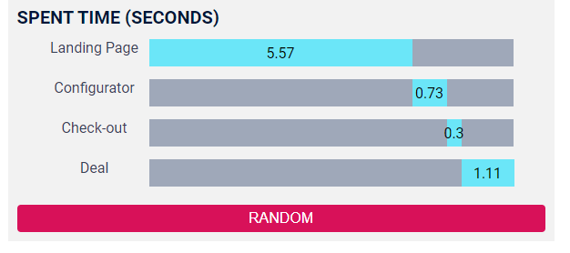

# SPENT TIME APP.

## About
The chart shows the average time "spent" by a user per page.
Every 0.53 min time change randomly (from 0 to 10).

[DEMO LINK](https://twoandmore.github.io/dmytrukfe22092022/)

## The Chart


Every time you press a button, the data will change.

## How to work with. Steps:
1. Download or clone repository. `git clone https://github.com/TwoAndMore/dmytrukfe22092022.git`.
2. Open project folder with code editor (VS Code, WebStorm, other).
3. Run ```npm install``` in terminal.
4. Open second terminal and run ```npm start```.
5. If tab does not open, go to ```http://localhost:3000``` in your browser.
